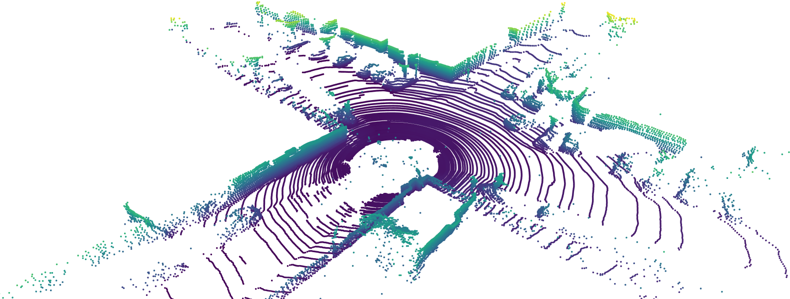
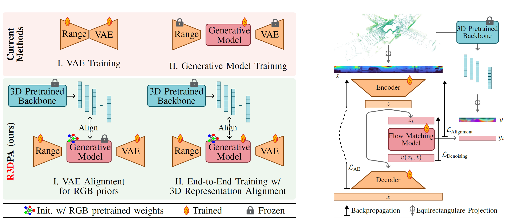

<h1 align="center"> <span style="color: red;">R3D</span>PA: Leveraging 3D Representation Alignment and RGB Pretrained Priors for LiDAR Scene Generation</h1>

<p align="center">
  <a href="https://scholar.google.com/citations?user=9Mr--hUAAAAJ" target="_blank">Nicolas&nbsp;Sereyjol-Garros</a> &ensp; <b>&middot;</b> &ensp;
  <a href="https://ellingtonkirby.github.io/" target="_blank">Ellington&nbsp;Kirby</a> &ensp; <b>&middot;</b> &ensp;
  <a href="https://scholar.google.com/citations?user=n_C2h-QAAAAJ&hl=en" target="_blank">Victor&nbsp;Besnier</a> &ensp; <b>&middot;</b> &ensp;
  <a href="https://nerminsamet.github.io/" target="_blank">Nermin&nbsp;Samet</a>&ensp;
</p>

<p align="center">
  Valeo.ai, Paris, France &emsp; </sub>
</p>

<p align="center">
  <a href="">🌐 Project Page</a> &ensp;
  <a href="">📃 Paper</a>
</p>



## Overview
LiDAR scene synthesis is an emerging solution
to scarcity in 3D data for robotic tasks such as autonomous
driving. Recent approaches employ diffusion or flow matching
models to generate realistic scenes, but 3D data remains limited
compared to RGB datasets with millions of samples. We introduce
<span style="color: red;">R3D</span>PA, the first LiDAR scene generation method to unlock
image-pretrained priors for LiDAR point clouds, and leverage
self-supervised 3D representations for state-of-the-art results.
Specifically, we (i) align intermediate features of our generative
model with self-supervised 3D features, which substantially
improves generation quality; (ii) transfer knowledge from largescale
image-pretrained generative models to LiDAR generation,
mitigating limited LiDAR datasets; and (iii) enable point cloud
control at inference for object inpainting and scene mixing with
solely an unconditional model. On the KITTI-360 benchmark
<span style="color: red;">R3D</span>PA achieves state of the art performance.



LiDAR point cloud generation from range images commonly follows a two-stage approach: the VAE is trained
independently and then frozen, while the generative model is trained on
its latent space. In contrast, our method leverages priors from a backbone
pretrained on large-scale image datasets. The alignment step trains the
VAE from scratch while initializing and freezing the generative model
with pretrained weights. This stage ensures that the latent space of our
newly trained VAE remains compatible with the knowledge of the pretrained
generative model. We then jointly optimize the VAE encoder and the
generative model under the supervision of 3D representations. Range
VAE denotes a model trained on range images.


## Getting Started
### 1. Environment Setup
To set up our environment, please run:

```bash
git clone https://github.com/R3DPA/R3DPA.git
cd R3DPA
conda env create -f environment.yml
conda activate r3dpa
```

### 2. Prepare the training data
Put the KITTI-360 dataset under the dataset folder.

Download ScaLR

Install WaffleIron package
```bash
cd ..
git clone https://github.com/valeoai/WaffleIron
cd WaffleIron
pip install -e ./
cd ../R3DPA
```

Pre compute features 

```bash
python feature_extraction/preprocess_scalr_fearures.py \
--dataset-path dataset \
--model-path pretrained_weights/scalr/WI_768-DINOv2_ViT_L_14-NS_KI_PD
```

### 3. Pretrain the generative model on RGB images

Follow the steps described in [REPA-E](https://github.com/End2End-Diffusion/REPA-E)

Or download our pretrained weights

### 3. Train the <span style="color: red;">R3D</span>PA model

* End-to-end training from scratch
```bash
bash scripts/train_e2e.sh 
```

* VAE alignment

Put in `scripts/train_vae_align.sh` the right SiT pretrained on RGB images checkpoint path and run
```bash
bash scripts/train_vae_align.sh 
```

* End-to-end tuning from pretrained weights
```bash
bash scripts/tuning_e2e.sh 
```


### 5. Generate samples

To generate samples and save them in a `.npz` file for evaluation, run the following script after after making sure the parameters match your model path. 
```bash
bash scripts/sample.sh 
```

### 6. Evaluation

Download statistics from the release or recompute them with the following command.

```bash
python -m eval.extract_logits_dataset \
    --save_path log/activations \
    --dataset_path dataset/KITTI-360
```

Install the following packages and run the evaluation script.

```bash
apt-get install libsparsehash-dev
pip install git+https://github.com/mit-han-lab/torchsparse.git@v1.4.0
```

```bash
python evaluate.py --config-path configs/eval/ablations/r3dpa.yaml
```

### Quantitative Results

| **Method**       | **FRID**<br>×10⁰ | **FLD**<br>×10⁻¹ | **FSVD**<br>×10⁰ | **FPVD**<br>×10⁰ | **JSD**<br>×10⁻² | **MMD**<br>×10⁻⁵ |
| :--------------- | :--------------: | :--------------: | :--------------: | :--------------: | :--------------: | :--------------: |
| UltraLiDAR       |         –        |         –        |       73.59      |       65.83      |       74.72      |      123.30      |
| LiDM             |       47.33      |       10.19      |       16.01      |       17.36      |       19.17      |       11.32      |
| LiDM w/ APE      |       42.09      |       9.76       |       13.68      |       13.86      |       11.69      |       9.95       |
| R2DM             |       15.54      |       <u>7.89 <u/>      |       <u>12.67 <u/>    |       <u>13.21 <u/>     |       <u>5.78 <u/>      |        <u>8.50 <u/>       |
| R2Flow           |       <u>8.87 <u/>     |       8.36       |       20.80      |       20.27      |       5.97       |     **7.84**     |
| **<span style="color: red;">R3D</span>PA (ours)** |     **8.46**     |     **6.34**     |     **9.83**     |     **11.00**    |     **5.67**     |      8.72      |

* Bold = best result; underlined = second-best result.

* FRID and FLD measure generation quality in the range image level.

* FSVD and FPVD measure quality in the point-cloud space.

* JSD and MMD evaluate similarity in the bird’s-eye view.

## Acknowledgement
This codebase is largely built upon:
- [REPA-E](https://github.com/End2End-Diffusion/REPA-E)
- [LiDAR-Diffusion](https://github.com/hancyran/LiDAR-Diffusion)

We sincerely thank the authors for making their work publicly available.

## 📚 Citation
If you find our work useful, please consider citing:

```bibtex

```
